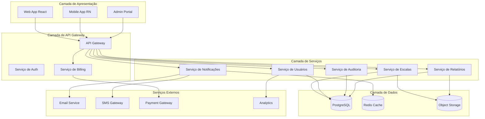
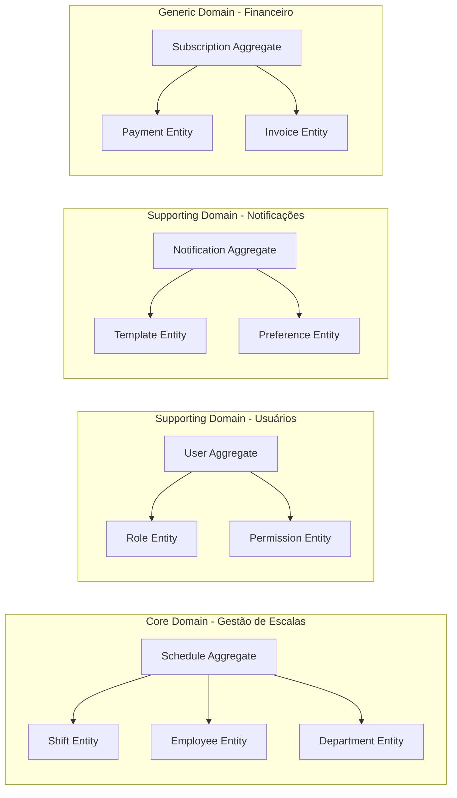
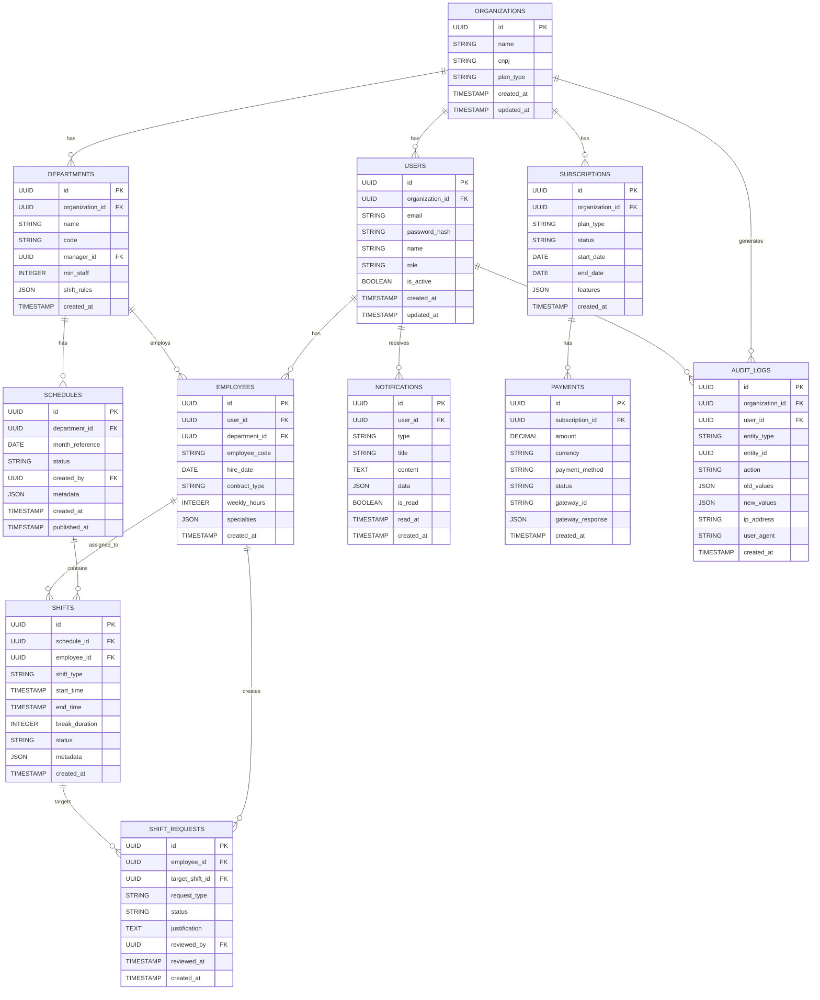
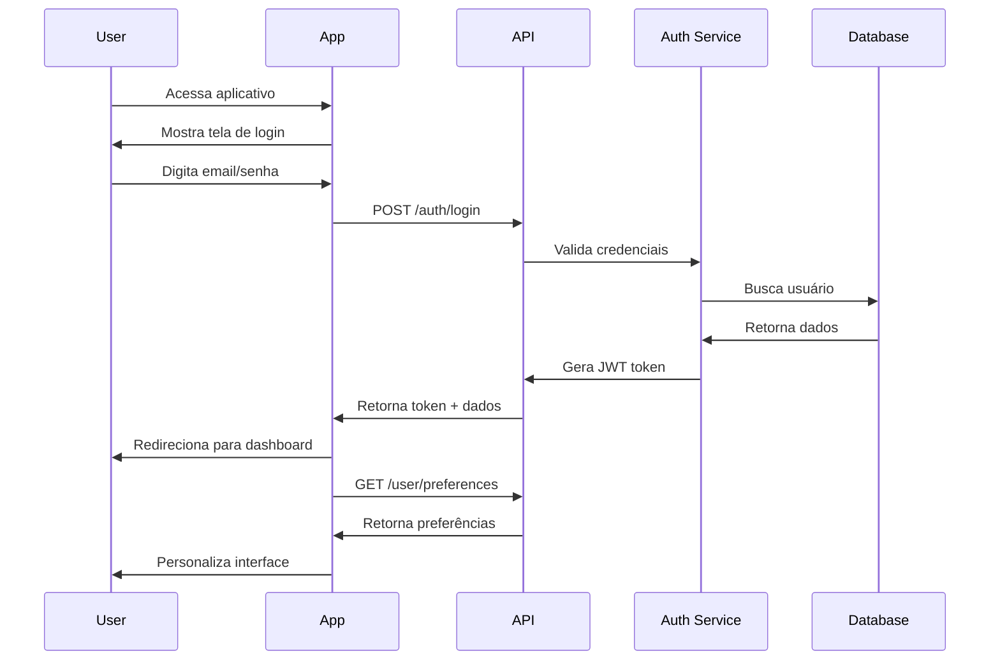
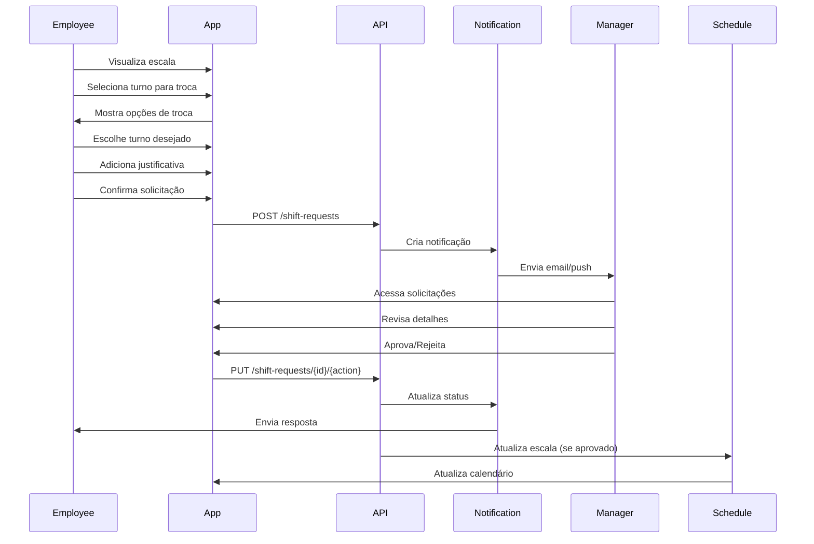
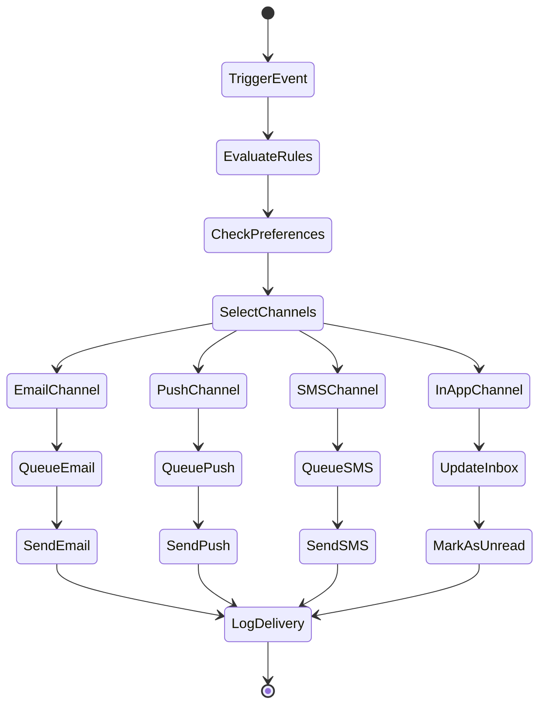
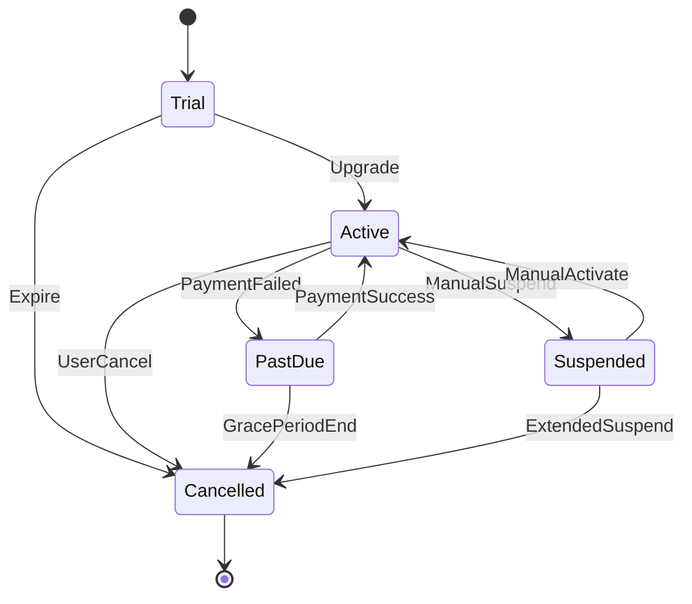
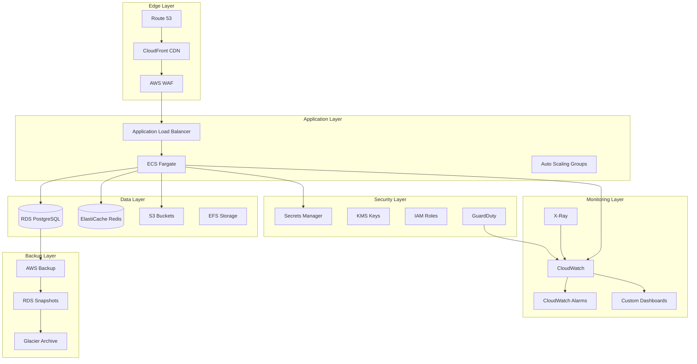

# GETESCALA - Architecture Bible

## 1. Visão Geral do Produto

GETESCALA é uma plataforma SaaS de gestão de escalas profissionais e plantões, projetada para hospitais, clínicas, empresas de segurança e outros setores que necessitam de controle rigoroso de escalas de trabalho. A plataforma resolve o problema complexo de gerenciar turnos, férias, trocas de plantão e garantir compliance regulatório.

**Problemas resolvidos:**
- Eliminação de conflitos de escalas e sobreposições de plantões
- Redução de 80% no tempo de criação de escalas mensais
- Garantia de compliance com regulamentações trabalhistas
- Gestão centralizada de trocas e solicitações

**Público-alvo:**
- Hospitais e redes de saúde (principal mercado)
- Clínicas médicas e odontológicas
- Empresas de segurança privada
- Indústrias com operação 24/7
- Call centers e centros de distribuição

## 2. Arquitetura do Sistema

### 2.1 Arquitetura Geral



### 2.2 Padrões Arquiteturais

**Clean Architecture com Modular Monolith**
- Domínio independente de frameworks
- Separação clara entre regras de negócio e infraestrutura
- Módulos independentes para fácil manutenção

**Event-Driven Architecture**
- Eventos de domínio para comunicação entre módulos
- Fila de mensagens para processamento assíncrono
- Event sourcing para auditoria completa

**CQRS (Command Query Responsibility Segregation)**
- Separar comandos de escritura de queries de leitura
- Otimização de performance para relatórios complexos
- Escalabilidade independente de leitura e escrita

## 3. Modelo de Domínio (Domain Model)

### 3.1 Domínios Principais



### 3.2 Entidades de Domínio

**Schedule Aggregate Root**
- schedule_id (UUID)
- department_id (UUID)
- month_reference (Date)
- status (Draft, Published, Locked)
- created_by (UUID)
- metadata (JSON)

**Shift Entity**
- shift_id (UUID)
- schedule_id (UUID)
- employee_id (UUID)
- shift_type (Morning, Afternoon, Night, Custom)
- start_time (Timestamp)
- end_time (Timestamp)
- break_duration (Integer)
- status (Assigned, Completed, Cancelled)

**Employee Entity**
- employee_id (UUID)
- user_id (UUID)
- department_id (UUID)
- employee_code (String)
- hire_date (Date)
- contract_type (CLT, PJ, Temporary)
- weekly_hours (Integer)
- specialties (Array)

## 4. Banco de Dados - Schema Completo

### 4.1 Diagrama ER



### 4.2 Scripts DDL

```sql
-- Tabela: organizations
CREATE TABLE organizations (
    id UUID PRIMARY KEY DEFAULT gen_random_uuid(),
    name VARCHAR(255) NOT NULL,
    cnpj VARCHAR(14) UNIQUE,
    plan_type VARCHAR(50) DEFAULT 'free',
    metadata JSONB DEFAULT '{}',
    created_at TIMESTAMP WITH TIME ZONE DEFAULT NOW(),
    updated_at TIMESTAMP WITH TIME ZONE DEFAULT NOW()
);

-- Tabela: users
CREATE TABLE users (
    id UUID PRIMARY KEY DEFAULT gen_random_uuid(),
    organization_id UUID NOT NULL REFERENCES organizations(id),
    email VARCHAR(255) UNIQUE NOT NULL,
    password_hash VARCHAR(255) NOT NULL,
    name VARCHAR(255) NOT NULL,
    role VARCHAR(50) DEFAULT 'employee',
    is_active BOOLEAN DEFAULT true,
    last_login_at TIMESTAMP WITH TIME ZONE,
    created_at TIMESTAMP WITH TIME ZONE DEFAULT NOW(),
    updated_at TIMESTAMP WITH TIME ZONE DEFAULT NOW()
);

-- Tabela: departments
CREATE TABLE departments (
    id UUID PRIMARY KEY DEFAULT gen_random_uuid(),
    organization_id UUID NOT NULL REFERENCES organizations(id),
    name VARCHAR(255) NOT NULL,
    code VARCHAR(50) NOT NULL,
    manager_id UUID REFERENCES users(id),
    min_staff INTEGER DEFAULT 1,
    shift_rules JSONB DEFAULT '{}',
    created_at TIMESTAMP WITH TIME ZONE DEFAULT NOW(),
    updated_at TIMESTAMP WITH TIME ZONE DEFAULT NOW()
);

-- Tabela: employees
CREATE TABLE employees (
    id UUID PRIMARY KEY DEFAULT gen_random_uuid(),
    user_id UUID UNIQUE NOT NULL REFERENCES users(id),
    department_id UUID NOT NULL REFERENCES departments(id),
    employee_code VARCHAR(50) UNIQUE NOT NULL,
    hire_date DATE NOT NULL,
    contract_type VARCHAR(50) NOT NULL,
    weekly_hours INTEGER DEFAULT 44,
    specialties JSONB DEFAULT '[]',
    created_at TIMESTAMP WITH TIME ZONE DEFAULT NOW(),
    updated_at TIMESTAMP WITH TIME ZONE DEFAULT NOW()
);

-- Tabela: schedules
CREATE TABLE schedules (
    id UUID PRIMARY KEY DEFAULT gen_random_uuid(),
    department_id UUID NOT NULL REFERENCES departments(id),
    month_reference DATE NOT NULL,
    status VARCHAR(50) DEFAULT 'draft',
    created_by UUID NOT NULL REFERENCES users(id),
    metadata JSONB DEFAULT '{}',
    created_at TIMESTAMP WITH TIME ZONE DEFAULT NOW(),
    published_at TIMESTAMP WITH TIME ZONE,
    UNIQUE(department_id, month_reference)
);

-- Tabela: shifts
CREATE TABLE shifts (
    id UUID PRIMARY KEY DEFAULT gen_random_uuid(),
    schedule_id UUID NOT NULL REFERENCES schedules(id),
    employee_id UUID REFERENCES employees(id),
    shift_type VARCHAR(50) NOT NULL,
    start_time TIMESTAMP WITH TIME ZONE NOT NULL,
    end_time TIMESTAMP WITH TIME ZONE NOT NULL,
    break_duration INTEGER DEFAULT 60,
    status VARCHAR(50) DEFAULT 'assigned',
    metadata JSONB DEFAULT '{}',
    created_at TIMESTAMP WITH TIME ZONE DEFAULT NOW(),
    updated_at TIMESTAMP WITH TIME ZONE DEFAULT NOW()
);

-- Tabela: shift_requests
CREATE TABLE shift_requests (
    id UUID PRIMARY KEY DEFAULT gen_random_uuid(),
    employee_id UUID NOT NULL REFERENCES employees(id),
    target_shift_id UUID NOT NULL REFERENCES shifts(id),
    request_type VARCHAR(50) NOT NULL,
    status VARCHAR(50) DEFAULT 'pending',
    justification TEXT,
    reviewed_by UUID REFERENCES users(id),
    reviewed_at TIMESTAMP WITH TIME ZONE,
    created_at TIMESTAMP WITH TIME ZONE DEFAULT NOW(),
    updated_at TIMESTAMP WITH TIME ZONE DEFAULT NOW()
);

-- Tabela: notifications
CREATE TABLE notifications (
    id UUID PRIMARY KEY DEFAULT gen_random_uuid(),
    user_id UUID NOT NULL REFERENCES users(id),
    type VARCHAR(50) NOT NULL,
    title VARCHAR(255) NOT NULL,
    content TEXT NOT NULL,
    data JSONB DEFAULT '{}',
    is_read BOOLEAN DEFAULT false,
    read_at TIMESTAMP WITH TIME ZONE,
    created_at TIMESTAMP WITH TIME ZONE DEFAULT NOW()
);

-- Tabela: subscriptions
CREATE TABLE subscriptions (
    id UUID PRIMARY KEY DEFAULT gen_random_uuid(),
    organization_id UUID NOT NULL REFERENCES organizations(id),
    plan_type VARCHAR(50) NOT NULL,
    status VARCHAR(50) DEFAULT 'active',
    start_date DATE NOT NULL,
    end_date DATE,
    features JSONB DEFAULT '{}',
    created_at TIMESTAMP WITH TIME ZONE DEFAULT NOW(),
    updated_at TIMESTAMP WITH TIME ZONE DEFAULT NOW()
);

-- Tabela: payments
CREATE TABLE payments (
    id UUID PRIMARY KEY DEFAULT gen_random_uuid(),
    subscription_id UUID NOT NULL REFERENCES subscriptions(id),
    amount DECIMAL(10,2) NOT NULL,
    currency VARCHAR(3) DEFAULT 'BRL',
    payment_method VARCHAR(50) NOT NULL,
    status VARCHAR(50) DEFAULT 'pending',
    gateway_id VARCHAR(255),
    gateway_response JSONB DEFAULT '{}',
    created_at TIMESTAMP WITH TIME ZONE DEFAULT NOW(),
    updated_at TIMESTAMP WITH TIME ZONE DEFAULT NOW()
);

-- Tabela: audit_logs
CREATE TABLE audit_logs (
    id UUID PRIMARY KEY DEFAULT gen_random_uuid(),
    organization_id UUID NOT NULL REFERENCES organizations(id),
    user_id UUID REFERENCES users(id),
    entity_type VARCHAR(100) NOT NULL,
    entity_id UUID NOT NULL,
    action VARCHAR(50) NOT NULL,
    old_values JSONB DEFAULT '{}',
    new_values JSONB DEFAULT '{}',
    ip_address INET,
    user_agent TEXT,
    created_at TIMESTAMP WITH TIME ZONE DEFAULT NOW()
);

-- Índices para performance
CREATE INDEX idx_users_organization_id ON users(organization_id);
CREATE INDEX idx_users_email ON users(email);
CREATE INDEX idx_departments_organization_id ON departments(organization_id);
CREATE INDEX idx_employees_department_id ON employees(department_id);
CREATE INDEX idx_schedules_department_id ON schedules(department_id);
CREATE INDEX idx_schedules_month_reference ON schedules(month_reference);
CREATE INDEX idx_shifts_schedule_id ON shifts(schedule_id);
CREATE INDEX idx_shifts_employee_id ON shifts(employee_id);
CREATE INDEX idx_shifts_start_time ON shifts(start_time);
CREATE INDEX idx_shift_requests_employee_id ON shift_requests(employee_id);
CREATE INDEX idx_notifications_user_id ON notifications(user_id);
CREATE INDEX idx_notifications_created_at ON notifications(created_at DESC);
CREATE INDEX idx_audit_logs_organization_id ON audit_logs(organization_id);
CREATE INDEX idx_audit_logs_entity ON audit_logs(entity_type, entity_id);
CREATE INDEX idx_audit_logs_created_at ON audit_logs(created_at DESC);

-- Permissões básicas para Supabase
GRANT SELECT ON ALL TABLES IN SCHEMA public TO anon;
GRANT ALL PRIVILEGES ON ALL TABLES IN SCHEMA public TO authenticated;
GRANT ALL PRIVILEGES ON ALL SEQUENCES IN SCHEMA public TO authenticated;
```

## 5. APIs REST

### 5.1 Authentication API

```
POST /api/v1/auth/login
```

Request:
```json
{
  "email": "usuario@empresa.com",
  "password": "senha123",
  "organization_id": "uuid-da-organizacao"
}
```

Response:
```json
{
  "access_token": "jwt-token",
  "refresh_token": "refresh-token",
  "user": {
    "id": "uuid",
    "name": "João Silva",
    "email": "usuario@empresa.com",
    "role": "manager",
    "organization": {
      "id": "uuid",
      "name": "Hospital São Paulo",
      "plan_type": "enterprise"
    }
  },
  "permissions": ["read:schedules", "write:schedules", "manage:employees"]
}
```

### 5.2 Schedules API

```
GET /api/v1/schedules?department_id={id}&month={YYYY-MM}
POST /api/v1/schedules
PUT /api/v1/schedules/{id}
DELETE /api/v1/schedules/{id}
POST /api/v1/schedules/{id}/publish
POST /api/v1/schedules/{id}/duplicate
```

Criar Escala:
```json
POST /api/v1/schedules
{
  "department_id": "uuid",
  "month_reference": "2024-03",
  "shifts": [
    {
      "employee_id": "uuid",
      "shift_type": "morning",
      "start_time": "2024-03-01T06:00:00Z",
      "end_time": "2024-03-01T14:00:00Z"
    }
  ]
}
```

### 5.3 Shift Requests API

```
GET /api/v1/shift-requests?employee_id={id}&status={pending}
POST /api/v1/shift-requests
PUT /api/v1/shift-requests/{id}/approve
PUT /api/v1/shift-requests/{id}/reject
```

### 5.4 Employees API

```
GET /api/v1/employees?department_id={id}&active={true}
POST /api/v1/employees
PUT /api/v1/employees/{id}
DELETE /api/v1/employees/{id}
GET /api/v1/employees/{id}/schedule-preferences
```

### 5.5 Notifications API

```
GET /api/v1/notifications?user_id={id}&unread={true}
POST /api/v1/notifications/mark-as-read
POST /api/v1/notifications/preferences
```

### 5.6 Reports API

```
GET /api/v1/reports/overtime?month={YYYY-MM}&department_id={id}
GET /api/v1/reports/absence-rate?period={quarterly}
GET /api/v1/reports/cost-analysis?month={YYYY-MM}
GET /api/v1/reports/compliance?start_date={date}&end_date={date}
```

### 5.7 Billing API

```
GET /api/v1/billing/subscription
POST /api/v1/billing/upgrade-plan
GET /api/v1/billing/invoices
POST /api/v1/billing/payment-method
```

## 6. Frontend Architecture

### 6.1 Stack Tecnológico
- **Framework:** React 18.2.0
- **Build Tool:** Vite 4.4.0
- **Type System:** TypeScript 5.0
- **State Management:** Redux Toolkit + RTK Query
- **UI Library:** Material-UI 5.14
- **Forms:** React Hook Form + Yup
- **Charts:** Recharts 2.7
- **Calendar:** FullCalendar 6.1
- **Testing:** Jest + React Testing Library + Cypress

### 6.2 Estrutura de Componentes

```
src/
├── components/
│   ├── common/
│   │   ├── Layout/
│   │   ├── Header/
│   │   ├── Sidebar/
│   │   └── LoadingSpinner/
│   ├── schedule/
│   │   ├── ScheduleCalendar/
│   │   ├── ShiftEditor/
│   │   ├── EmployeeSelector/
│   │   └── ConflictDetector/
│   ├── employees/
│   │   ├── EmployeeList/
│   │   ├── EmployeeForm/
│   │   └── EmployeeProfile/
│   └── reports/
│       ├── OvertimeChart/
│       ├── ComplianceReport/
│       └── CostAnalysis/
├── pages/
│   ├── Dashboard/
│   ├── ScheduleManagement/
│   ├── EmployeeManagement/
│   ├── Reports/
│   └── Settings/
├── hooks/
│   ├── useAuth.ts
│   ├── useSchedule.ts
│   ├── useNotification.ts
│   └── usePermission.ts
├── services/
│   ├── api/
│   ├── auth.service.ts
│   ├── schedule.service.ts
│   └── notification.service.ts
├── store/
│   ├── authSlice.ts
│   ├── scheduleSlice.ts
│   └── notificationSlice.ts
└── utils/
    ├── constants.ts
    ├── validators.ts
    └── formatters.ts
```

### 6.3 Design System

**Cores Primárias:**
- Primary: #1976D2 (Blue 700)
- Secondary: #424242 (Grey 800)
- Success: #388E3C (Green 700)
- Warning: #F57C00 (Orange 700)
- Error: #D32F2F (Red 700)

**Tipografia:**
- Font Family: Inter, Roboto, sans-serif
- Headers: 600 weight
- Body: 400 weight
- Small text: 300 weight

**Componentes Customizados:**
- ScheduleCalendar: Visualização mensal/semanal com drag-and-drop
- ShiftCard: Cards coloridos por tipo de turno
- ConflictBadge: Indicadores visuais de conflitos
- EmployeeAvatar: Avatares com indicadores de status

## 7. Mobile Architecture (React Native)

### 7.1 Stack Tecnológico
- **Framework:** React Native 0.72
- **Navigation:** React Navigation 6
- **State:** Redux Toolkit + RTK Query
- **UI:** React Native Elements + Native Base
- **Push Notifications:** React Native Firebase
- **Offline:** Redux Persist + NetInfo
- **Geolocation:** React Native Geolocation
- **Calendar:** React Native Calendar

### 7.2 Estrutura de Módulos

```
app/
├── navigation/
│   ├── AppNavigator.tsx
│   ├── AuthNavigator.tsx
│   └── TabNavigator.tsx
├── screens/
│   ├── Auth/
│   ├── Dashboard/
│   ├── Schedule/
│   ├── Notifications/
│   └── Profile/
├── components/
│   ├── common/
│   ├── schedule/
│   └── notifications/
├── services/
│   ├── api.service.ts
│   ├── push.service.ts
│   └── offline.service.ts
├── store/
├── utils/
└── assets/
```

### 7.3 Funcionalidades Mobile

**Dashboard Mobile:**
- Visualização rápida do plantão atual
- Próximos turnos com contador regressivo
- Notificações push de mudanças
- Acesso offline aos dados críticos

**Gestão de Turnos:**
- Visualização de escala mensal/semanal
- Solicitação de troca de plantão
- Confirmação de leitura de escala
- Check-in/out com geolocalização

**Notificações Inteligentes:**
- Lembretes de plantão (2h antes)
- Avisos de mudanças na escala
- Confirmações de solicitações
- Alertas de conflitos

## 8. Fluxos de Usuário (User Flows)

### 8.1 Fluxo de Autenticação



### 8.2 Fluxo de Criação de Escala

```mermaid
flowchart TD
    A[Gerente acessa Dashboard] --> B{Clicar em "Nova Escala"}
    B --> C[Selecionar Departamento]
    C --> D[Selecionar Mês de Referência]
    D --> E{Sistema verifica conflitos}
    E -->|Sem conflitos| F[Carregar template anterior]
    E -->|Com conflitos| G[Mostrar alertas]
    G --> H[Resolver conflitos]
    H --> F
    F --> I[Distribuir turnos automaticamente]
    I --> J[Visualizar rascunho]
    J --> K{Revisar e ajustar}
    K -->|Sim| L[Editar manualmente]
    L --> J
    K -->|Não| M[Publicar escala]
    M --> N[Notificar funcionários]
    N --> O[Escala ativa]
```

### 8.3 Fluxo de Solicitação de Troca



### 8.4 Fluxo de Notificação



## 9. Módulos do Sistema

### 9.1 Módulo de Gestão de Escalas
**Responsabilidades:**
- Criar e gerenciar escalas mensais
- Detectar e resolver conflitos
- Calcular horas trabalhadas
- Gerenciar tipos de turno
- Exportar relatórios

**Componentes principais:**
- ScheduleService
- ConflictDetector
- ShiftCalculator
- ScheduleRepository

### 9.2 Módulo de Funcionários
**Responsabilidades:**
- Gerenciar cadastro de funcionários
- Controlar disponibilidade
- Administrar férias e afastamentos
- Gerenciar competências e especialidades

**Componentes principais:**
- EmployeeService
- AvailabilityService
- VacationService
- CompetencyService

### 9.3 Módulo de Solicitações
**Responsabilidades:**
- Processar solicitações de troca
- Gerenciar aprovações
- Controlar limite de solicitações
- Notificar envolvidos

**Componentes principais:**
- ShiftRequestService
- ApprovalWorkflow
- RequestLimitService
- NotificationService

### 9.4 Módulo de Notificações
**Responsabilidades:**
- Enviar notificações multi-canal
- Gerenciar preferências de usuário
- Controlar frequência e timing
- Rastrear entrega e leitura

**Componentes principais:**
- NotificationService
- ChannelManager
- PreferenceService
- DeliveryTracker

### 9.5 Módulo de Relatórios
**Responsabilidades:**
- Gerar relatórios de horas extras
- Analisar taxa de ausência
- Calcular custos operacionais
- Verificar compliance regulatório

**Componentes principais:**
- ReportService
- AnalyticsEngine
- ComplianceChecker
- ExportService

### 9.6 Módulo de Auditoria
**Responsabilidades:**
- Registrar todas as operações
- Manter histórico de mudanças
- Detectar acessos suspeitos
- Gerar logs de segurança

**Componentes principais:**
- AuditService
- ChangeTracker
- SecurityMonitor
- LogRepository

## 10. Sistema Financeiro

### 10.1 Modelos de Precificação

**Plano Free (Gratuito)**
- Até 10 funcionários
- 1 departamento
- Funcionalidades básicas
- Suporte por email (48h)

**Plano Starter (R$ 299/mês)**
- Até 50 funcionários
- 3 departamentos
- Todas as funcionalidades básicas
- Suporte prioritário (24h)
- Relatórios básicos

**Plano Professional (R$ 799/mês)**
- Até 200 funcionários
- Departamentos ilimitados
- Funcionalidades avançadas
- API de integração
- Suporte VIP (4h)
- Relatórios avançados
- Integração com folha de pagamento

**Plano Enterprise (Sob consulta)**
- Funcionários ilimitados
- Todos os recursos
- White-label
- Suporte dedicado
- SLA garantido
- Implementação customizada

### 10.2 Processamento de Pagamentos

**Gateway:** Stripe + PagSeguro
**Métodos:**
- Cartão de crédito
- Boleto bancário
- PIX
- Débito automático

**Ciclo de Cobrança:**
1. Fatura gerada 10 dias antes do vencimento
2. Notificação por email 7 dias antes
3. Tentativa de cobrança automática
4. Grace period de 3 dias
5. Suspensão do serviço
6. Cancelamento após 30 dias

### 10.3 Gestão de Assinaturas



## 11. Sistema de Notificações

### 11.1 Tipos de Notificações

**Notificações de Sistema:**
- Criação de nova escala
- Mudanças na escala publicada
- Solicitações de troca
- Aprovações/rejeições
- Lembretes de plantão

**Notificações de Segurança:**
- Login em novo dispositivo
- Múltiplas tentativas de login
- Alteração de senha
- Acesso suspeito

**Notificações Comerciais:**
- Vencimento de assinatura
- Atualizações do sistema
- Novos recursos disponíveis
- Promoções e descontos

### 11.2 Canais de Entrega

**Email (Prioridade 1)**
- Templates HTML responsivos
- Suporte a múltiplos idiomas
- Tracking de abertura
- Unsubscribe automático

**Push Notifications (Prioridade 2)**
- iOS e Android
- Rich notifications com ações
- Silent updates
- Geofencing

**SMS (Prioridade 3)**
- Para alertas críticos
- Código de confirmação
- Lembretes importantes
- Custo adicional

**In-App (Sempre)**
- Centro de notificações
- Badges e contadores
- Filtros por tipo
- Marcar como lido

### 11.3 Template Engine

```javascript
interface NotificationTemplate {
  id: string;
  type: 'email' | 'push' | 'sms' | 'inapp';
  subject?: string;
  title?: string;
  body: string;
  variables: string[];
  enabled: boolean;
  priority: number;
}

const templates: NotificationTemplate[] = [
  {
    id: 'schedule_published',
    type: 'email',
    subject: 'Nova escala publicada - {{month}}',
    body: `
      Olá {{employee_name}},
      
      A escala de {{month}} foi publicada.
      Seu próximo plantão: {{next_shift_date}} às {{next_shift_time}}.
      
      Acesse o sistema para visualizar detalhes.
      
      Atenciosamente,
      Equipe {{organization_name}}
    `,
    variables: ['employee_name', 'month', 'next_shift_date', 'next_shift_time', 'organization_name'],
    enabled: true,
    priority: 1
  }
];
```

## 12. Sistema de Permissões (RBAC)

### 12.1 Modelo de Permissões

**Hierarquia de Papéis:**
```
Super Admin (Sistema)
├── Organization Admin (Organização)
├── Department Manager (Departamento)
├── Team Leader (Equipe)
└── Employee (Funcionário)
```

### 12.2 Permissões por Papel

**Super Admin:**
- Gerenciar organizações
- Acessar todos os dados
- Configurar sistema
- Visualizar auditoria global

**Organization Admin:**
- Gerenciar departamentos
- Criar escalas organizacionais
- Gerenciar usuários
- Acessar relatórios completos
- Configurar integrações

**Department Manager:**
- Gerenciar equipe
- Criar escalas departamentais
- Aprovar solicitações
- Visualizar relatórios do departamento

**Team Leader:**
- Visualizar equipe
- Criar escalas parciais
- Revisar solicitações
- Acessar indicadores básicos

**Employee:**
- Visualizar própria escala
- Solicitar trocas
- Atualizar disponibilidade
- Acessar histórico pessoal

### 12.3 Estrutura de Permissões

```json
{
  "permissions": {
    "schedules": {
      "create": ["organization_admin", "department_manager"],
      "read": ["all"],
      "update": ["organization_admin", "department_manager", "team_leader"],
      "delete": ["organization_admin", "department_manager"],
      "publish": ["organization_admin", "department_manager"]
    },
    "employees": {
      "create": ["organization_admin", "department_manager"],
      "read": ["organization_admin", "department_manager", "team_leader"],
      "update": ["organization_admin", "department_manager", "employee_own"],
      "delete": ["organization_admin"]
    },
    "shift_requests": {
      "create": ["all"],
      "approve": ["organization_admin", "department_manager", "team_leader"],
      "manage": ["employee_own", "manager_above"]
    }
  }
}
```

### 12.4 Middleware de Autorização

```typescript
interface PermissionMiddleware {
  requiredPermissions: string[];
  resource?: string;
  scope?: 'own' | 'department' | 'organization' | 'global';
}

const authorize = (options: PermissionMiddleware) => {
  return async (req: Request, res: Response, next: NextFunction) => {
    const user = req.user;
    const resourceId = req.params.id;
    
    // Verificar papel do usuário
    const userRole = user.role;
    const userPermissions = await getUserPermissions(user.id);
    
    // Verificar permissões necessárias
    const hasPermission = options.requiredPermissions.every(permission =>
      userPermissions.includes(permission)
    );
    
    if (!hasPermission) {
      return res.status(403).json({ error: 'Insufficient permissions' });
    }
    
    // Verificar escopo de acesso
    const hasScope = await verifyScope(user, resourceId, options.scope);
    
    if (!hasScope) {
      return res.status(403).json({ error: 'Access denied for this resource' });
    }
    
    next();
  };
};
```

## 13. Sistema de Auditoria

### 13.1 Requisitos de Auditoria

**Compliance LGPD:**
- Consentimento explícito
- Direito ao esquecimento
- Portabilidade de dados
- Acesso aos dados pessoais

**Compliance Trabalhista:**
- Registro de horas trabalhadas
- Controle de sobreposições
- Gestão de intervalos
- Controle de jornada

**Auditoria de Segurança:**
- Tentativas de acesso
- Alterações críticas
- Acessos suspeitos
- Violações de segurança

### 13.2 Eventos Auditáveis

```typescript
enum AuditEventType {
  USER_LOGIN = 'user_login',
  USER_LOGOUT = 'user_logout',
  USER_CREATE = 'user_create',
  USER_UPDATE = 'user_update',
  USER_DELETE = 'user_delete',
  SCHEDULE_CREATE = 'schedule_create',
  SCHEDULE_UPDATE = 'schedule_update',
  SCHEDULE_PUBLISH = 'schedule_publish',
  SHIFT_ASSIGN = 'shift_assign',
  SHIFT_REMOVE = 'shift_remove',
  REQUEST_CREATE = 'request_create',
  REQUEST_APPROVE = 'request_approve',
  REQUEST_REJECT = 'request_reject',
  PERMISSION_GRANT = 'permission_grant',
  PERMISSION_REVOKE = 'permission_revoke',
  DATA_EXPORT = 'data_export',
  DATA_DELETE = 'data_delete'
}

interface AuditEvent {
  id: string;
  organizationId: string;
  userId: string;
  eventType: AuditEventType;
  entityType: string;
  entityId: string;
  action: string;
  oldValues: Record<string, any>;
  newValues: Record<string, any>;
  metadata: {
    ipAddress: string;
    userAgent: string;
    timestamp: Date;
    correlationId: string;
  };
}
```

### 13.3 Sistema de Log

**Camadas de Log:**
1. **Application Logs:** Eventos do sistema
2. **Audit Logs:** Mudanças de dados
3. **Security Logs:** Eventos de segurança
4. **Access Logs:** Requisições HTTP

**Retenção de Dados:**
- Application Logs: 30 dias
- Audit Logs: 5 anos (obrigatório legal)
- Security Logs: 1 ano
- Access Logs: 90 dias

**Armazenamento:**
- PostgreSQL para consultas rápidas (últimos 90 dias)
- S3 para arquivamento (90 dias - 5 anos)
- Glacier para backup (5+ anos)

### 13.4 Monitoramento de Conformidade

```typescript
class ComplianceMonitor {
  async checkWorkingHours(employeeId: string, period: DateRange): Promise<ComplianceReport> {
    const shifts = await this.getEmployeeShifts(employeeId, period);
    const totalHours = this.calculateTotalHours(shifts);
    const consecutiveDays = this.countConsecutiveWorkingDays(shifts);
    const restPeriods = this.checkRestPeriods(shifts);
    
    return {
      employeeId,
      period,
      totalHours,
      consecutiveDays,
      restPeriods,
      violations: this.identifyViolations({
        totalHours,
        consecutiveDays,
        restPeriods
      }),
      recommendations: this.generateRecommendations(shifts)
    };
  }
  
  private identifyViolations(metrics: WorkMetrics): Violation[] {
    const violations: Violation[] = [];
    
    if (metrics.totalHours > 220) {
      violations.push({
        type: 'EXCESSIVE_HOURS',
        severity: 'HIGH',
        description: 'Jornada mensal excede 220 horas',
        legalReference: 'CLT Art. 7º'
      });
    }
    
    if (metrics.consecutiveDays > 6) {
      violations.push({
        type: 'INSUFFICIENT_REST',
        severity: 'MEDIUM',
        description: 'Mais de 6 dias consecutivos trabalhados',
        legalReference: 'CLT Art. 67'
      });
    }
    
    return violations;
  }
}
```

## 14. Infraestrutura Cloud

### 14.1 Arquitetura de Infraestrutura



### 14.2 Configuração de Ambientes

**Desenvolvimento (DEV):**
- 1 instância t3.small (API)
- 1 instância t3.micro (Banco)
- Redis cache.t3.micro
- Load balancer mínimo
- Logs básicos

**Homologação (STG):**
- 2 instâncias t3.medium (API)
- 1 instância t3.small (Banco)
- Redis cache.t3.small
- Load balancer com health checks
- Monitoramento completo

**Produção (PRD):**
- Mínimo 3 instâncias t3.large (API)
- RDS Multi-AZ t3.large
- Redis cache.t3.medium cluster
- Load balancer com WAF
- Monitoramento avançado + X-Ray

### 14.3 Segurança de Infraestrutura

**Network Security:**
- VPC privada com subnets públicas/privadas
- Security Groups restritivos
- NACLs adicionais
- VPC Flow Logs habilitados

**Data Security:**
- RDS encryption at rest
- S3 bucket encryption
- EFS encryption
- Secrets Manager para senhas

**Access Control:**
- IAM roles por serviço
- MFA obrigatório
- Access keys rotativas
- CloudTrail habilitado

**DDoS Protection:**
- AWS Shield Standard
- CloudFront para distribuição
- Rate limiting no ALB
- WAF rules customizadas

### 14.4 Disaster Recovery

**RTO (Recovery Time Objective): 4 horas**
**RPO (Recovery Point Objective): 1 hora**

**Estratégia de Backup:**
- RDS: Automated backups a cada 1 hora
- S3: Versionamento + Cross-region replication
- EFS: AWS Backup diário
- Configurações: Git + Terraform state

**Procedimentos de Failover:**
1. RDS Multi-AZ automático
2. Redis cluster com failover
3. ECS service discovery
4. Route53 health checks
5. Runbooks documentados

## 15. CI/CD Pipeline

### 15.1 Pipeline de Desenvolvimento

```mermaid
graph LR
    subgraph "Development Phase"
        DEV[Developer] --> GIT[Git Push]
        GIT --> PRE[Pre-commit Hooks]
        PRE --> LINT[Linting]
        LINT --> TEST[Unit Tests]
    end
    
    subgraph "CI Phase"
        TEST --> BUILD[Build Application]
        BUILD --> IT[Integration Tests]
        IT --> SEC[Security Scan]
        SEC --> COV[Coverage Report]
    end
    
    subgraph "CD Phase"
        COV --> DOCK[Build Docker Image]
        DOCK --> PUSH[Push to Registry]
        PUSH --> DEPLOY[Deploy to Staging]
        DEPLOY --> E2E[E2E Tests]
    end
    
    subgraph "Production Phase"
        E2E --> APPROVE[Manual Approval]
        APPROVE --> PROD[Deploy to Production]
        PROD --> SMOKE[Smoke Tests]
        SMOKE --> MONITOR[Monitor Health]
    end
    
    subgraph "Rollback"
        MONITOR --> FAIL{Health Check?}
        FAIL -->|Failed| ROLLBACK[Automatic Rollback]
        FAIL -->|Success| SUCCESS[Deployment Complete]
    end
```



### 15.2 Ferramentas de CI/CD

**GitHub Actions (Principal):**
```yaml
name: CI/CD Pipeline
on:
  push:
    branches: [main, develop]
  pull_request:
    branches: [main]

jobs:
  test:
    runs-on: ubuntu-latest
    steps:
      - uses: actions/checkout@v3
      - name: Setup Node.js
        uses: actions/setup-node@v3
        with:
          node-version: '18'
      - name: Install dependencies
        run: npm ci
      - name: Run linter
        run: npm run lint
      - name: Run tests
        run: npm test -- --coverage
      - name: Upload coverage
        uses: codecov/codecov-action@v3

  build:
    needs: test
    runs-on: ubuntu-latest
    steps:
      - uses: actions/checkout@v3
      - name: Build Docker image
        run: |
          docker build -t getescala/api:${{ github.sha }} .
          docker tag getescala/api:${{ github.sha }} getescala/api:latest
      - name: Push to registry
        run: |
          echo ${{ secrets.DOCKER_PASSWORD }} | docker login -u ${{ secrets.DOCKER_USERNAME }} --password-stdin
          docker push getescala/api:${{ github.sha }}
          docker push getescala/api:latest

  deploy-staging:
    needs: build
    runs-on: ubuntu-latest
    if: github.ref == 'refs/heads/develop'
    steps:
      - name: Deploy to staging
        run: |
          aws ecs update-service --cluster staging --service getescala-api --force-new-deployment
```

**Ferramentas Adicionais:**
- **SonarQube:** Análise de código
- **Snyk:** Vulnerabilidades de segurança
- **Cypress:** Testes E2E
- **Terraform:** Infraestrutura como código
- **Ansible:** Configuração de servidores

### 15.3 Estratégias de Deploy

**Blue-Green Deployment:**
- Ambiente blue (ativo) e green (standby)
- Zero downtime
- Rollback instantâneo
- Duplicação de recursos

**Canary Deployment:**
- Deploy gradual (10% → 50% → 100%)
- Monitoramento de métricas
- Rollback automático
- Economia de recursos

**Feature Flags:**
- Toggle de funcionalidades
- Gradual rollout
- A/B testing
- Kill switch

### 15.4 Monitoramento de Deploy

**Métricas de Saúde:**
- Error rate < 1%
- Response time < 500ms
- CPU usage < 80%
- Memory usage < 85%
- Database connections < 80%

**Alertas:**
- Slack integration
- PagerDuty para incidentes
- Email para warnings
- Dashboard em tempo real

## 16. Estratégia de Escalabilidade

### 16.1 Escalabilidade Vertical vs Horizontal

**Vertical Scaling (Scale-Up):**
- Aumentar recursos da instância
- Limite físico do hardware
- Downtime necessário
- Custo exponencial

**Horizontal Scaling (Scale-Out):**
- Adicionar mais instâncias
- Limite teórico infinito (na nuvem)
- Zero downtime
- Custo linear

**Estratégia GETESCALA:** Horizontal scaling com auto-scaling groups

### 16.2 Auto-Scaling Configuration

```yaml
# ECS Service Auto Scaling
ScalingPolicy:
  Type: AWS::ApplicationAutoScaling::ScalingPolicy
  Properties:
    PolicyName: GetescalaAPIScalingPolicy
    PolicyType: TargetTrackingScaling
    ScalingTargetId: !Ref ScalableTarget
    TargetTrackingScalingPolicyConfiguration:
      TargetValue: 70.0
      PredefinedMetricSpecification:
        PredefinedMetricType: ECSServiceAverageCPUUtilization
      ScaleOutCooldown: 300
      ScaleInCooldown: 300

ScalableTarget:
  Type: AWS::ApplicationAutoScaling::ScalableTarget
  Properties:
    MaxCapacity: 10
    MinCapacity: 2
    ResourceId: !Sub service/${Cluster}/${Service}
    RoleARN: !Sub arn:aws:iam::${AWS::AccountId}:role/aws-service-role/ecs.application-autoscaling.amazonaws.com/AWSServiceRoleForApplicationAutoScaling_ECSService
    ScalableDimension: ecs:service:DesiredCount
    ServiceNamespace: ecs
```

### 16.3 Database Scaling Strategy

**Leitura (Read Replicas):**
- Até 5 read replicas
- Distribuição geográfica
- Failover automático
- Query optimization

**Escrita (Sharding):**
- Shard por organization_id
- Consistent hashing
- Cross-shard queries mínimas
- Data migration tools

**Cache Strategy:**
- Redis Cluster para session cache
- CloudFront para assets estáticos
- Application-level caching
- Database query cache

### 16.4 Microservices Decomposition

**Fase 1 (Atual):** Monolito modular
**Fase 2 (6 meses):** Extrair serviços críticos
- Notification Service
- Audit Service
- Report Service

**Fase 3 (12 meses):** Decomposição completa
- Schedule Service
- Employee Service
- Billing Service
- Auth Service

**Fase 4 (18 meses):** Event-driven architecture
- Event sourcing
- CQRS implementation
- Saga pattern para transações

### 16.5 Performance Optimization

**Frontend:**
- Code splitting por rotas
- Lazy loading de componentes
- Image optimization (WebP)
- Service workers para offline
- CDN para assets estáticos

**Backend:**
- Connection pooling
- Query optimization
- Database indexing
- Async processing
- Rate limiting

**Database:**
- Índices compostos
- Particionamento por data
- Vacuum automático
- Query plan analysis
- Connection pooling

### 16.6 Capacidade e Previsão

**Cenário Base (Ano 1):**
- 100 organizações
- 10.000 usuários ativos
- 50.000 requests/day
- 2GB storage/month

**Cenário de Crescimento (Ano 2):**
- 500 organizações
- 50.000 usuários ativos
- 500.000 requests/day
- 20GB storage/month

**Cenário de Escalabilidade (Ano 3):**
- 2.000 organizações
- 200.000 usuários ativos
- 5.000.000 requests/day
- 100GB storage/month

**Previsão de Custos:**
- Ano 1: $2.000/mês
- Ano 2: $8.000/mês
- Ano 3: $25.000/mês

## 17. Roadmap do Produto

### 17.1 MVP - Fase 1 (3 meses)

**Mês 1: Fundação**
- [ ] Setup do projeto e arquitetura
- [ ] Autenticação e autorização
- [ ] CRUD de organizações e usuários
- [ ] Banco de dados e API base
- [ ] Deploy inicial em staging

**Mês 2: Core Functionality**
- [ ] Criação de escalas básicas
- [ ] Visualização em formato de calendário
- [ ] Gestão de funcionários
- [ ] Sistema de notificações básico
- [ ] Dashboard inicial

**Mês 3: Integração e Testes**
- [ ] Solicitações de troca simples
- [ ] Relatórios básicos
- [ ] Testes de integração
- [ ] Correção de bugs
- [ ] Deploy em produção (beta)

### 17.2 Fase 2 - Recursos Avançados (3 meses)

**Mês 4: Inteligência e Automação**
- [ ] Algoritmo de distribuição automática
- [ ] Detecção de conflitos inteligente
- [ ] Sugestões de otimização
- [ ] Templates de escalas
- [ ] Importação em lote

**Mês 5: Mobile e Notificações**
- [ ] Aplicativo mobile (iOS/Android)
- [ ] Push notifications
- [ ] Geolocalização para check-in
- [ ] Modo offline
- [ ] Widgets de escala

**Mês 6: Analytics e Relatórios**
- [ ] Dashboard avançado com KPIs
- [ ] Relatórios customizáveis
- [ ] Exportação para Excel/PDF
- [ ] Gráficos interativos
- [ ] Benchmarking interno

### 17.3 Fase 3 - Enterprise Features (3 meses)

**Mês 7: Integrações Corporativas**
- [ ] Integração com sistemas de folha de pagamento
- [ ] API REST completa
- [ ] Webhooks para eventos
- [ ] SSO (Single Sign-On)
- [ ] LDAP/Active Directory

**Mês 8: Compliance e Segurança**
- [ ] Auditoria completa (LGPD)
- [ ] Certificações de segurança
- [ ] Gestão avançada de permissões
- [ ] Criptografia end-to-end
- [ ] Backup automatizado

**Mês 9: Performance e Escalabilidade**
- [ ] Otimização de performance
- [ ] Cache distribuído
- [ ] CDN global
- [ ] Auto-scaling
- [ ] Monitoramento APM

### 17.4 Fase 4 - Inovação e IA (6 meses)

**Mês 10-11: Machine Learning**
- [ ] Predição de ausências
- [ ] Otimização de custos
- [ ] Análise de padrões
- [ ] Recomendações personalizadas
- [ ] Detecção de anomalias

**Mês 12: Inteligência Avançada**
- [ ] Chatbot para suporte
- [ ] Análise preditiva de turnover
- [ ] Planejamento de férias otimizado
- [ ] Balanceamento de carga de trabalho
- [ ] Insights automáticos

### 17.5 Fase 5 - Expansão Global (6 meses)

**Mês 13-14: Internacionalização**
- [ ] Multi-idioma (EN, ES, FR)
- [ ] Suporte a fusos horários
- [ ] Moedas locais
- [ ] Regulamentações internacionais
- [ ] Datacenters globais

**Mês 15-16: Parcerias e Marketplace**
- [ ] Programa de parceiros
- [ ] Marketplace de integrações
- [ ] API para desenvolvedores
- [ ] White-label para empresas
- [ ] Programa de afiliados

**Mês 17-18: Ecosistema Completo**
- [ ] Comunidade de usuários
- [ ] Universidade corporativa
- [ ] Certificações
- [ ] Eventos e conferências
- [ ] Fundo de investimento

### 17.6 Métricas de Sucesso por Fase

**MVP (Fase 1):**
- 10 clientes beta
- 500 usuários ativos
- 95% uptime
- <2s tempo de resposta

**Crescimento (Fase 2-3):**
- 100 clientes pagantes
- 5.000 usuários ativos
- 99.5% uptime
- <1s tempo de resposta

**Escala (Fase 4-5):**
- 1.000 clientes globais
- 50.000 usuários ativos
- 99.9% uptime
- <500ms tempo de resposta
- Expansão internacional

### 17.7 KPIs de Produto

**Adoption Metrics:**
- Monthly Active Users (MAU)
- Daily Active Users (DAU)
- User Growth Rate
- Feature Adoption Rate

**Engagement Metrics:**
- Session Duration
- Feature Usage
- Return Rate
- Net Promoter Score (NPS)

**Business Metrics:**
- Monthly Recurring Revenue (MRR)
- Customer Acquisition Cost (CAC)
- Customer Lifetime Value (CLV)
- Churn Rate
- Average Revenue Per User (ARPU)

**Technical Metrics:**
- System Uptime
- Response Time
- Error Rate
- Security Incidents
- Performance Score

Este documento representa a visão completa e detalhada da arquitetura do GETESCALA, fornecendo uma base sólida para o desenvolvimento de um SaaS de gestão de escalas profissionais pronto para escala global.